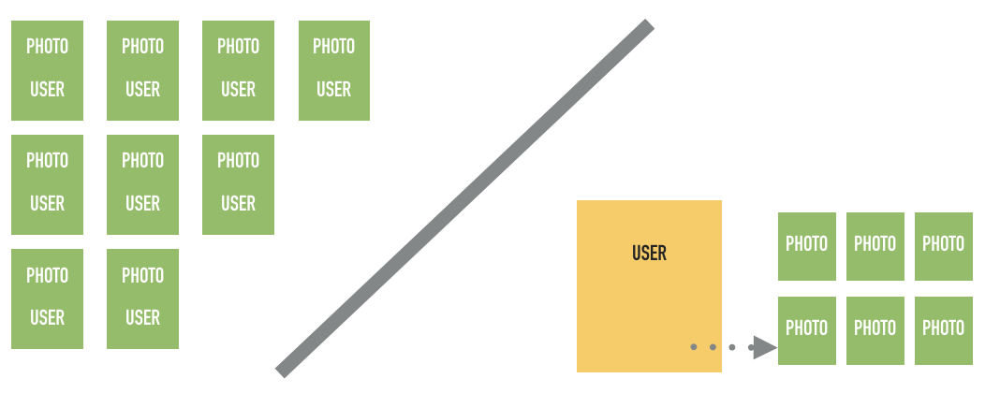

Session Materials
================================================================================
* [Slides]({{ site.cdn }}/sessions/session2/mpcs51033-2019-autumn-lecture-2.pdf)


* GitHub Classroom Links:
    - GCP Backend https://classroom.github.com/a/x91wat1G
    - Mobile App https://classroom.github.com/a/KKacrlWx

Resources
================================================================================

* Flask
    - [Building Flask Routes](https://hackersandslackers.com/the-art-of-building-flask-routes/)
   
* Building Scalable Apps (2011, but still relevant)
  - [Google I/O 2011: Scaling App Engine Applications - YouTube](https://www.youtube.com/watch?v=rP-kjrx9CRE&feature=youtu.be&app=desktop)

* Datastore
  - [Entities](https://cloud.google.com/datastore/docs/concepts/entities)
  - [Building scalable apps with Cloud Datastore (Google Cloud Next '17) - YouTube](https://www.youtube.com/watch?v=0EIqacNVuAo&t=11s)

* Google Cloud Endpoints
  - [Quick Start](https://cloud.google.com/endpoints/docs/quickstart-endpoints)
  - [About Cloud Endpoints Frameworks](https://cloud.google.com/endpoints/docs/frameworks/python/about-cloud-endpoints-frameworks)
  - [Google Cloud Endpoints: serving your API to the world (Google Cloud Next '17) YouTube](https://www.youtube.com/watch?v=bR9hEyZ9774)

* Google APIs
    - [Google Vision API](https://cloud.google.com/vision/)


https://cloud.google.com/datastore/docs/


Assignment 2
================================================================================
As discussed in class, there are some potential issues with our photo timeline backend. In the fist part of the assignment you will update our existing code base ([available here on Github](https://github.com/uchicago-cloud/mpcs51033-2019-autumn-photo-timelime-starter)) with the following changes.

Update the Data Model
--------------------------------------------------------------------------------
Our data model works fine for a small number of users, but if (when ) our app goes viral, querying for a users photos will be inefficient and potentially costly.  


* Add a `User` model entity to the application with the following properties:
  - `name`
  - `email`
  - `unique_id` (you can choose to use the `Key` property or use a custom uuid)
  - `photos` (reference to a collection of the users photos)
  - `username`
  - `password`
  - `id_token` (a unique urlsafe string that anonymously identifies this user)

  > We will use some of these fields for next week

* When a photo is uploaded it should be added to a collection of the users photos. The photos should still be stored in Google Cloud Storage, but the references to it should be stored with the `User` entitity.


* Update the `Photo` model to reflect the new `User` model. We will have a reference to it from the `User` object but we want to keep all the information about the photo in a `Photo` entity.  Remember that every bit of data we store has a resource and economic cost.

* Add a text caption property to the `Photo` model

* Update all the queries to take advantage of the new `User` model. Also, make sure that the results are returned with the most recent photo first.

API
--------------------------------------------------------------------------------
* Create an API that exposes endpoints for all the services you will need to use from a mobile application. 

* Create a route that will return the photos in JSON. This is what should be used by your mobile application.

```python
@app.route('/data')
def data():
    """ Return a list of the users photos in JSON """
    pass
```

* Make sure to include an API to delete photos
>Remember that deleting the photo should remove it from storage and remove any references to it in the `User` model.

These are some examples of server calls. Use your new knowledge of API design to make sure that they make sense. Use GET, POST, DELETE, etc. appropriately.

```bash
# Get a json list of most recent submitted pictures
http://--.appspot.com/<USERNAME> [GET]

# Endpoint for posting images to server
http://--.appspot.com/<USERNAME>  [POST]

# See a list of the most recent on a web page (useful for debugging
http://--.appspot.com/<USERNAME>/web [GET]

# Endpoint for retrieving an image
http://--.appspot.com/<USERNAME>/<IMAGEID>  [GET]

# Endpoint for deleting an image
http://--.appspot.com/<USERNAME>/<IMAGEID>  [DELETE]
```

* The API should also be able to used using the `curl` command and the web interface. The functionality in the starter web interface is fine.


<!--

Improve Security for Users
--------------------------------------------------------------------------------
Currently our app offers no security to protect our users or our resources.  Anyone with the API can post and retrieve any users pictures.  

* Add an authentication API that passes a username and password and (if successful) returns a unique token.


This token would be stored on the users device and passed as a parameter on all future API requests.  The unique token is represented in our datastore as `unique_id`.  

* The authentication API call should take a similar form:

```
http://--.appspot.com/user/authenticate/?username=XXX&password=XXXX
```

> You can assume that the validation is always successful for the assignment. That is, the password is always correct.

* Create an API that uses some of the best practices that were discussed in class. The API calls should require the token to be passed as a parameter as follows:

```
# Get a json list of most recent submitted pictures
http://--.appspot.com/user/<USERNAME>/json/?id_token=XXXX


# See a list of the most recent on a web page (useful for debugging
http://--.appspot.com/user/<USERNAME>/web/?id_token=XXXX

# Endpoint for posting images to server. There is an optional "caption" parameter that you can use.
http://--.appspot.com/post/<USERNAME>/?id_token=XXXX
```

* Update the backend  application (in all appropriate places) to validate any request by testing that the token is valid (ie. is in the database).  If the user makes an API call without an `id_token` return a HTTP Code of 401 Unauthorized access.
-->

Automated Photo Labeling with Google Vision
--------------------------------------------------------------------------------
Use the [Google Vision API](https://cloud.google.com/vision/docs/labels) to detect and identify labels in your users images.  
* Create a new `labels` property on the `Photos` object.
* When a user uploads a new photo you should create a task to analyze the photo and add top 3 scoring label descriptions to the photo's `labels` property.

> Note that you will have to enable additional APIs and services from the console to accomplish this.

Mobile Client
--------------------------------------------------------------------------------
Build a bare bones mobile client to interact with the API. The user should be able to upload an image, view their most recent images in a table and delete images. Feel free to reuse code from previous projects for this. 


Grading
--------------------------------------------------------------------------------
The application should complete all of the requirements and function without errors.  The backend application should function on a local development server.  

Please include a list of  `curl` commands that can be used to test the application in the `NOTES.md` file.

You should have a deployed version running on Google App Engine.  Please include the URL to the deployed version in the `NOTES.md` file.

Companion mobile apps or scripts should compile with no errors or warnings and perform all described behaviors.

Due Date
--------------------------------------------------------------------------------
Assignment 2 is due **October 16, 2019 at 5:29pm.** Use the assignment repos in GitHub to submit your assignment.  Remember to include the requested information in the `NOTES.md` file. their respective README.md file.

> Note: Next week's assignment will build on these two applications