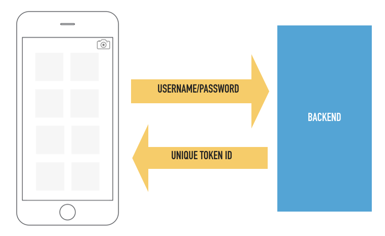
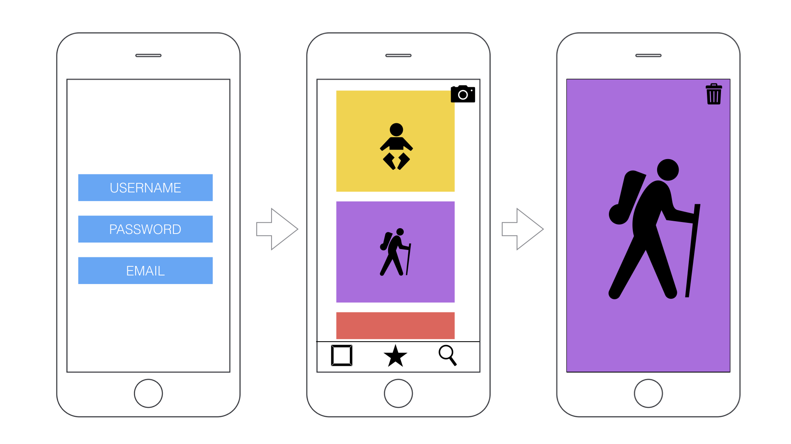

Session Materials
================================================================================
* [Slides](mpcs51033-2019-autumn-lecture-3.pdf)

* GitHub Classroom Links:
    - GCP Backend https://classroom.github.com/a/x91wat1G
    - Mobile App https://classroom.github.com/a/KKacrlWx

Resources
================================================================================

* Scheduling jobs with cron
    - https://cloud.google.com/appengine/docs/standard/python3/scheduling-jobs-with-cron-yaml

* Sending Mail from App Engine
    - https://cloud.google.com/appengine/docs/standard/python/mail/sending-messages
    - https://cloud.google.com/datastore/docs/
    - [Github sample project](https://github.com/GoogleCloudPlatform/python-docs-samples/tree/master/appengine/flexible/mailgun).

* Cursors
    - https://cloud.google.com/datastore/docs/concepts/queries#datastore-datastore-cursor-paging-python
     - https://cloud.google.com/datastore/docs/concepts/entities

* Google APIs
    - [Google Vision API](https://cloud.google.com/vision/)

* Cloud Tasks
    - https://cloud.google.com/tasks/docs/dual-overviewa

Assignment 3
================================================================================
Building off Assignment 2, we will complete our photo timelime application by adding a few new features and expanding on the functionality of the application.



Improve Security for Users
--------------------------------------------------------------------------------
Currently our app offers no security to protect our users or our resources.  Anyone with the API can post and retrieve any users pictures.  

* Add an authentication API that passes a username and password and (if successful) returns a unique token. 
> You can assume that the validation is always successful for this assignment. That is, the password is always correct.
* The authentication API call should take a similar form:

```
http://--.appspot.com/user/authenticate/?username=XXX&password=XXXX
```
* The unique token is represented in our datastore as `id_token`. 
* This token should be stored on the users device and passed as a parameter on all future API requests. The token can be passed in the URL, the body of the request, or the request header. 
```
http://--.appspot.com/user/data?id_tokem=XXX
```
* Update the backend application (in all appropriate places) to validate any request by testing that the token is valid (ie. the user exists in the database).  
* If the user makes an API call without an `id_token` return a HTTP Code of 401 Unauthorized access.

Welcome our Users
--------------------------------------------------------------------------------
When a user launches the app for the first time and successfully creates an account, send them an email welcoming them to your application. Use the [Mailgun](https://www.mailgun.com/) API to send out the emails.

There is a full working implemention of using this service from Google on [Github](https://github.com/GoogleCloudPlatform/python-docs-samples/tree/master/appengine/flexible/mailgun).


Favorite Pictures
--------------------------------------------------------------------------------
* Keep track of the number of views of each image by adding an additional property on the `Photo` entity named `views`. Each time a user views the picture, increment the count.
* Set up a cron job that runs every hour to coallate all the photo data and identify the three most viewed photos.
* When the cron job runs, it should update a newly created entity named `Favorites` with references to the favorite photos.
> Tip: While developing, have the cron job run more frequently so that you can test the behavior.
* The three favorites should be able to be viewed in the mobile app. It is up to you how you want to show the favorites (eg. tab bar view, popover, etc.)


Offload the Image Processing
------------------------------------------------------------------
The [Google Vision API](https://cloud.google.com/vision/docs/labels) works great to detect and identify labels in your users images, however, it threatens to put our requests over the execution time limit. To alleviate this, offload the image vision processing using Cloud Tasks.

* Create a Google Cloud Task queue dedicated to sending an image for vision processing
* Update `main.py` with an additional route handler for the task
* During the image upload, once the photo is stored in Cloud Storage, fire off the task. 
* You will need to pass along enough information so that the photo's entry in datastore can be updated once the processing is over.
* As long as we are doing some image processing (and have 24 hours for our task to complete) create a thumbnail image to store alongside the original version. Store the public url of this resized version in datastore. 
>There are many ways to accomplish this on GCP, but the most straightforward may be to import an additional library.
* Peform the image analysis on the original version.

Optimize for Scrolling
------------------------------------------------------------------
Nothing is more frustrating for users than when they can not scroll smootly through their photos. Implement the following improvements to try to minimizd this problem.

* A phone screen can only show so many photos, so limit the amount of data being requested and sent by using cursors. Use any of the approaches discussed in class (or create your own) that batches your request to a reasonable amount of data for imporoved performance.
* Update your application so that it uses the thumbnail versions of images except when image has been selected for viewing (ie. not in a table).

Mobile Client
-------------
The focus of this assignment is on developing a backend using Google Cloud Platform, however the mobile client needs to be able to support all the required functionality. You are free to use third-party code for the application.



### Login
* When a user uses the application for the first time they should be greeted with a login screen requesting a user name, password and email.
* For the assignemnt, we can assume that the user will never log out, therefore they should only see this screen one time.
* sends welcome email using Mailjet or malign?

### Home Screen
* After successfully authenticating, the user will see their photo feed. The most recent photos should be at the top.
* Tapping on a photo will present a view controller dedicated to the showing the photo. 

### Photo View
* This screen should present a full-screen view of the image.
* When this screen is shown, it should count as a 'view' for tracking the most viewed photos.
* The user should be able to delete the photo from this screen.

### Favorites
* Present the three most viewed photos. You can (and should) reuse the main home screen for this view.

### Storing and Caching
The peformance of your application will suffer if you are continiusly re-downloading data and assets every time your user launches the application. You should take careful consideration of the flow of data and implement some caching strategies. 

If you have not discovered it yet, `NSCache` is a fast, easy way to implement caching in your application. Here are some resources to get your started:
* [NSCache - Apple](https://developer.apple.com/documentation/foundation/nscache)
* [How to cache data using NSCache](https://www.hackingwithswift.com/example-code/system/how-to-cache-data-using-nscache)

At the minimum you should cache all the images you download and try to use the local version before redownloading.

Grading
-------
The application should complete all of the requirements and function without errors.  The backend application should function on a local development server.  You should have a deployed version running on Google App Engine.  Please include the URL to the deployed version in the `NOTES.md` file.

Please document your API and include a list of  `curl` commands that can be used to test the application in the `NOTES.md` file.

Companion mobile apps or scripts should compile with no errors or warnings and perform all described behaviors.

Bonus Point
-----------
Put all that Google Cloud Vision processing to work. Add a way to search your photo library by label. You may add a search bar to your home view or add a new view controller dedicated to this functionality.

Due Date
----------
Assignment 3 is due **October 23, 2019 at 5:29pm.** You may use the repos from Assignment 2 to submit your assignment. Please [tag](http://gitready.com/beginner/2009/02/03/tagging.html) your repository before beginning to work on Assignment 3. For example:

`git tag -a v1.0.0 -m "Begin Assignment 3."` 