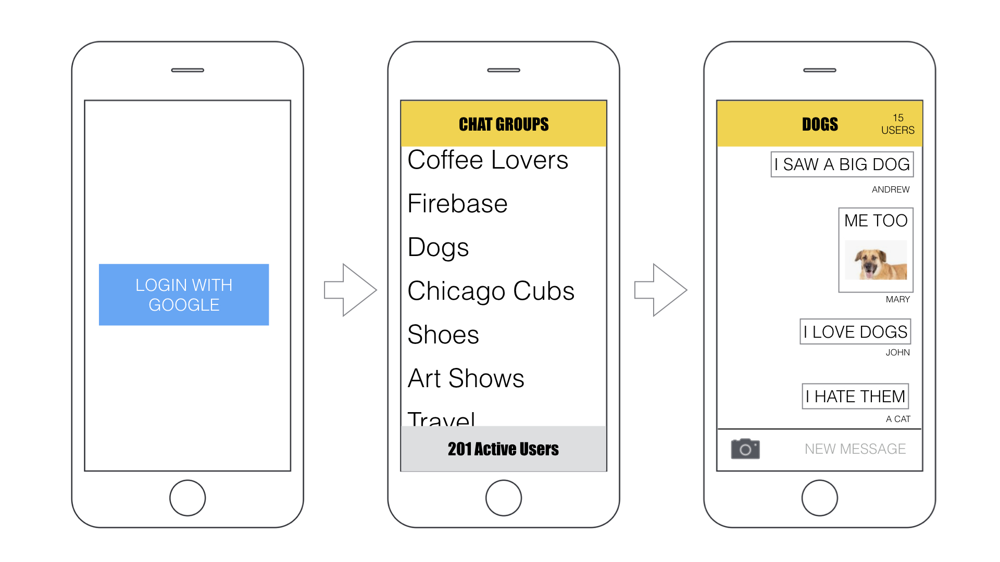
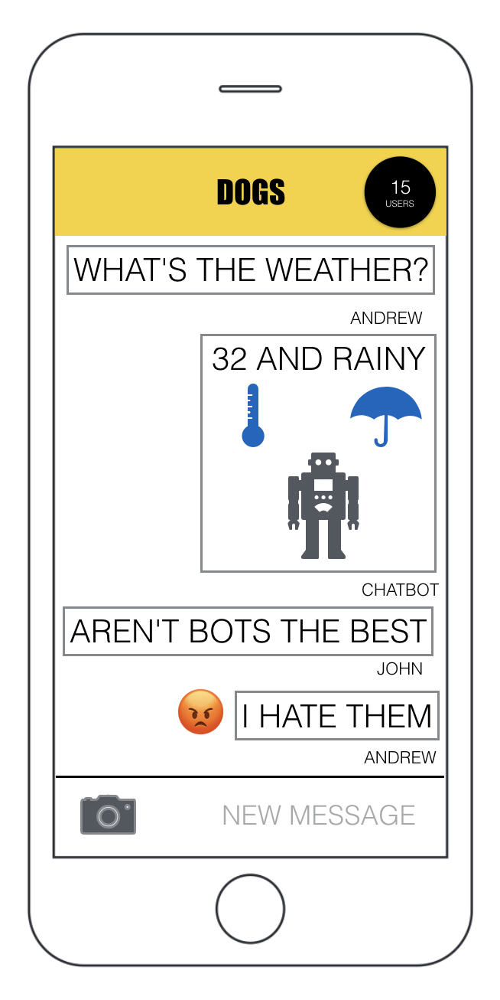
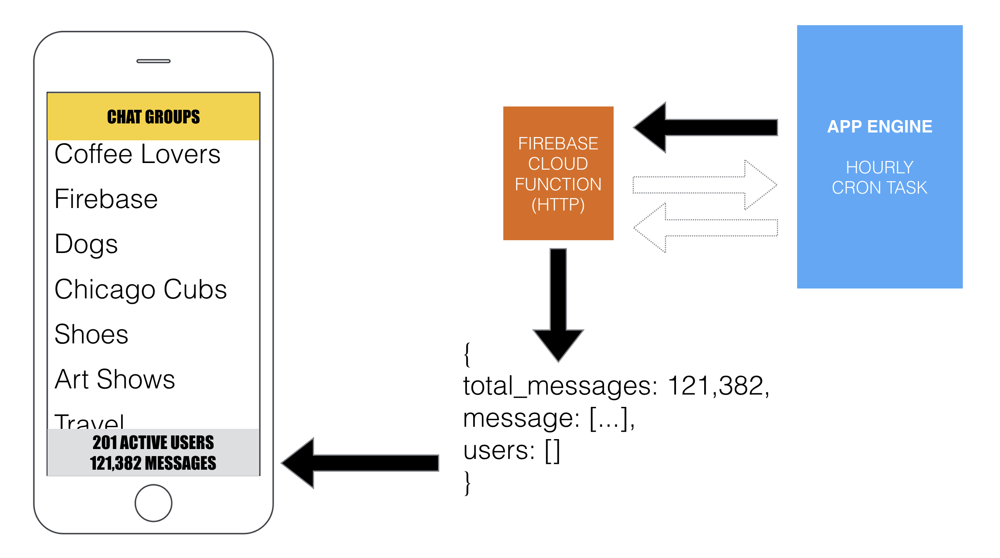

Session Materials
=================
* Session 5 [Slides](mpcs51033-2019-autumn-lecture-5.pdf)

Resources
=========
* Firebase Cloud Functions
  - [Codelab for chat app](https://codelabs.developers.google.com/codelabs/firebase-cloud-functions/index.html?index=..%2F..%2Findex#0)

* Firestore
 - [Codelab Restaurant Rater](https://codelabs.developers.google.com/codelabs/firestore-ios/#0)

* Firebase Invites
 - [Firebase Invites](https://firebase.google.com/docs/invites/ios)

* Firebase Remote Config
 - [Remote Config](https://firebase.google.com/docs/remote-config/use-config-ios)

* Firebase Dynamic Links
 - [Dynamic Links](https://firebase.google.com/docs/dynamic-links/)

* Apple Push Notifications
  - [Push Notifications Tutorial: Getting Started - Ray Wenderlich]( https://www.raywenderlich.com/156966/push-notifications-tutorial-getting-started)
  - [Local and Remote Notification Programming Guide](https://developer.apple.com/library/content/documentation/NetworkingInternet/Conceptual/RemoteNotificationsPG/APNSOverview.html#//apple_ref/doc/uid/TP40008194-CH8-SW1)
  - [Generate APNS certificate for iOS Push Notifications](https://medium.com/@ankushaggarwal/generate-apns-certificate-for-ios-push-notifications-85e4a917d522)

* Analytics
   - [Use Firebase Analytics to Build Extraordinary Apps - Google I/O 2016 - YouTube](https://www.youtube.com/watch?v=yi23CLNeGaw&t=923s)
   - [Getting Started with Firebase Analytics on iOS: Ev](https://www.youtube.com/watch?v=5pYdTgSkW5E)
 [Getting started with Firebase Analytics, BigQuery ](https://www.youtube.com/watch?v=Ki_F6VCOtXU)
   - [Firebase](https://www.youtube.com/user/Firebase)

* Crash reporting
   - [Introducing Firebase Crash Reporting - YouTube](https://www.youtube.com/watch?list=PLl-K7zZEsYLmOF_07IayrTntevxtbUxDL&v=B7mlLVAkcfU)

* CocoaPods
   - [CocoaPods.org](https://cocoapods.org/)
   - [An Introduction to Cocoa Pods](https://www.youtube.com/watch?v=iEAjvNRdZa0)

Assignment 5
============

In this assignment, you will create a group chat application that takes advantage of many features available through the Firebase platform. The application will incorporate common functionality of group chat applications to allow users to send messages to each other.

Hopefully, you will begin to see how some of the functionality you built into your Google Cloud Platform apps can be done more easily (but less flexibly and more expensively) on Firebase.

Overall Application Behavior
-----------------------------
All users will have to be authenticated with Google authentication for the application. After signing in, users should be presented with a list of chat groups that they belong to. Navigating to one of these groups should take them to the group chat where they can post 
new messages to the group.

All users of the application will be allowed to create a new chat group.

Authentication and Users
------------------------

All users will have to be authenticated using Google authentication to be users of this application. Once authenticated, the user should be added to a `user` database that uniquely identifies all the users of the application.

The first time that a user logs in to Firebase, send an email welcoming them to the application. This can be accomplished a couple different ways.

1) Using Firebase Cloud functions with an authentication trigger. You can send emails from the Google account associated with Firebase project.
2) Using the newly announced Firebase Extensions (which will require you to be on a Blaze account)
3) Use Cloud functions to trigger a call to a third-parity mailing API (you have already done this with App Engine).

Provide functionality to allow the users to log out of the application.

Chat Groups
-----------
Chat groups are created by users as a way to organize the chats. For example, the app might have a group called "Coffee Lovers" dedicated to talking about coffee. Another group, "Firebase" could be for students discussing how much they love Firebae.

Chat groups should have a name and a unique identifier so they are unambiguous. Keep track of which users are members to a chat group. You can consider a user a member of a group if they have contributed to the chat group by posting a message. 

In the chat group list, show the total number of users who are currently logged in to the application (ie. user presence). Also, show the total number of messages that have been posted to the group (see Cron Job).

Group Chats
-----------
Groups chats consist of a single threaded messages that are sent by any members of the group. A chat message can consist of text, image or both. The user who sent the message should be identifiable in some way. 

> There are third-party view controller for chat applications (eg. https://github.com/jessesquires/ JSQMessagesViewController) that provides an interface comparable to native messages application. Feel free to use one if you would like.

Somewhere on the chat screen, show how many members have participated in the chat group. Consider a user a member of the group if they have ever posted a message to the group. Please add a few extra sample users to pad out the statistics while you are developign and debugging the application.

MLKIT
-------------------
Firebase provides many options for adding additional functionality to your application through MLKit. Implement a new functionality of your choosing that uses MLKit.

Some suggestions are listed below:
* Add a 'Smart Replies' feature using natural language processing that lets users choose from pre-selected phrases for their messages.
* Add a 'Translate' feature that lets users translate all the messages to another language.
* Add image labeling to uploaded photos that enchance the conversation
* Create a ChatBot that tries to participate in the conversation using 'Smart Replies'

Cloud Functions
-------------------
As stated above, implement a Firebase Cloud function to send an email to a user when they authenticate for the first time welcoming them to the application. In addition, you are required to implement another Cloud Function of your own design. This function should perform some processing on either the text or image posted as part of the chat.

Some examples are listed below:
* Add an emoji if a keyword is detected (eg. :smile:, :angry:)
* Color or bold the text based on sentiment analysis
* Annotate a users image
* Remove/repalce any objectionable words (eg. a blacklist) with symbols (eg. XXXXXXX)
* Create a ChatBot that chimes into the conversation based on the last message. For example, if one of the messages mentions the word 'weather', have the ChatBot look up the weather and display a message with the forecast.

Firebase Cron 
-------------
It is possible to run Cloud Function trigger based on a schedule, but it is very limited in what it can do (at the time). This is the perfect opportunity to Integrate App Engine functionality to enhance our Firebase application.

To keep track of the total number of messages sent in the application, we will set up a simple cron job that will trigger a Cloud Function HTTP trigger. This trigger will then query our database, coallate the number of messages and store the current number in the database.

> You may want to create an App Engine project first ad then add the Firebase project to it during set up.

There are two approaches you can take, with the main difference being where you want to implement the logic to coallate the information, on App Engine or Firebase.

1. Cron job on App Engine makes http request which returns data. Data is processed and then App Engine makes a request to update the data.

2. Cron job on App Engine makes http request. Firebase runs the query and updates the table.

Database
------------------------------
Tough decision time. You may choose to implement the database in either the Realtime Database or Firestore. In you `README` file, please explain in a few sentences why you made you decision. 

>Imagine you are defending the choice to a group of investors who are questioning how well your app will scale.

Tutorials and Third-Party Code
------------------------------
This assignment aims to allow you to provide a fully featured application in a real-world scenario (ie. the Internet and tutorials exist). 

You can use any tutorials as references or third-party code for this assignment. Please include the required attribution. The majority of the work you will do will be interfacing with Firebase for your specific implementation.

Please look at the following tutorial for a chat application implementation: https://www.raywenderlich.com/5359-firebase-tutorial-real-time-chat. While this application does provide much of the functionality we are going to implement, you will see that it does not use best practices in structuring the datastore (according to Firebase). You should take care to structure you database that will allow it to scale as discussed in class and in the documentation.

Bonus Point
------------------------------
There are two options for a bonus point. You may choose one or do both:

* Add an option to allow users to join the chat anonymously. You should count them as users in the application. Indicate in the message view that they are anonymous users.

* Provide provide the current user is “typing” functionality. This can be inferred if the user is active in the text input field.

### Due Date ####
The focus of this assignment is the backend design and development. You may consider this document to be guidelines to follow. You may choose an alternate strategy for any part as of the assignment as long as your application performs the required functionality and you can justify your choices.

There are no specific requirements for the user interface and design of the iOS application. You can design it such that it performs all the required task...although, it wouldn’t take too much to make it look really nice.

The assignment is Due November 6, 2019 at 5:29 PM.

Use the assignment repos in GitHub to submit your assignment.  One for the Firebase client code and one for the App Engine Cron application. 

Please include the URL of the deployed Firebase and App Engine application in the respective `README.md` file.
