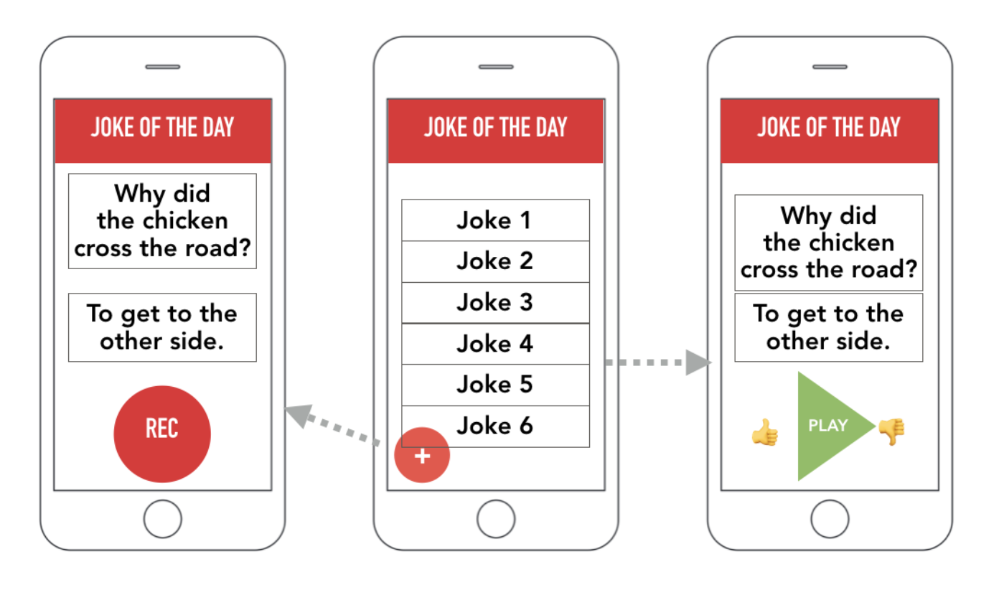
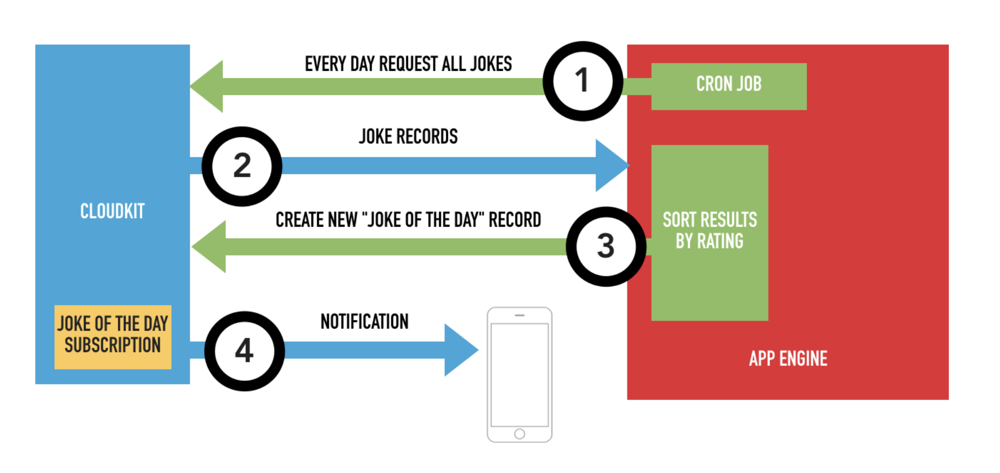
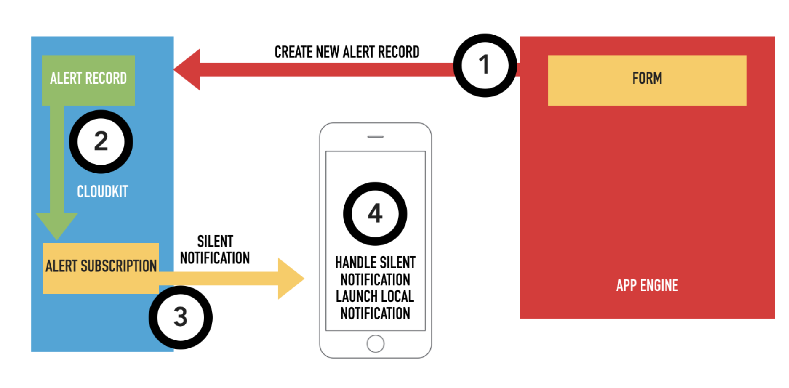

Session Materials
=================

* Session 7 [Slides](mpcs51033-2019-autumn-lecture-7.pdf)
* CloudKit demo from class [on GitHub](https://github.com/uchicago-cloud/mpcs50101-2019-autumn-cloud-kit-demo)
> This week's changes are in the `week2` branch
* CloudKit helper from class [on GitHub](https://github.com/uchicago-cloud/mpcs50133-2019-autumn-cloudkit-helper)

Resources
=========

* [iCloud - Apple Developer Videos](https://developer.apple.com/icloud/)
  - [What's New in CloudKit](https://developer.apple.com/videos/play/wwdc2016/226/)
  - [CloudKit Best Practices](https://developer.apple.com/videos/play/wwdc2016/231/)
  - [CloudKit JS and Web Services](https://developer.apple.com/videos/play/wwdc2015/710/)
  - [CloudKit Tips and Tricks](https://developer.apple.com/videos/play/wwdc2015/715/)
  - [Introducing CloudKit](https://developer.apple.com/videos/play/wwdc2014/208/)
  - [Advanced CloudKit](https://developer.apple.com/videos/play/wwdc2014/231/)

* Apple Documentation
  - [CloudKit Quick Start](https://developer.apple.com/library/prerelease/ios/documentation/DataManagement/Conceptual/CloudKitQuickStart/Introduction/Introduction.html)
  - [CloudKit JavaScript Reference](https://developer.apple.com/library/prerelease/ios/documentation/CloudKitJS/Reference/CloudKitJavaScriptReference/index.html)
  - [CloudKit Web Services Reference](https://developer.apple.com/library/prerelease/ios/documentation/DataManagement/Conceptual/CloutKitWebServicesReference/Introduction/Introduction.html)
  - [iCloud Design Guide](https://developer.apple.com/library/ios/icloud_design_guide)
  - [iOS Data Storage Guidelines](https://developer.apple.com/icloud/documentation/data-storage/)
  - [Preventing files from being backed up to iCloud or](https://developer.apple.com/library/ios/qa/qa1719/)

  * JS API Sample Site
  - [CloudKit Catalog](https://cdn.apple-cloudkit.com/cloudkit-catalog/)

* CloudKit Videos from WWDC 2014/2015
  - [Introducing CloudKit](https://developer.apple.com/videos/play/wwdc2014/208/)
  - [Advanced CloudKit](https://developer.apple.com/videos/play/wwdc2014/231/)
  - [What's New in CloudKit - WWDC 2015 - Videos - Apple Developer](https://developer.apple.com/videos/play/wwdc2015/704/)
  - [CloudKit Tips and Tricks - WWDC 2015 - Videos - Apple Developer](https://developer.apple.com/videos/play/wwdc2015/715/)

* CloudKit tutorials
  - [CloudKit - NSHipster](http://nshipster.com/cloudkit/)
  - [An iOS 10 CloudKit Example](http://www.techotopia.com/index.php/An_iOS_8_CloudKit_Example)
  -  [CloudKit Tutorial: Getting Started](https://www.raywenderlich.com/134694/cloudkit-tutorial-getting-started)
  - [Designing for CloudKit](https://developer.apple.com/library/ios/documentation/General/Conceptual/iCloudDesignGuide/DesigningforCloudKit/DesigningforCloudKit.html)
  - [Working With CloudKit Demo](http://www.appcoda.com/cloudkit-introduction-tutorial/)
  - [iOS8 Day-by-Day: Day 33 - CloudKit](http://www.shinobicontrols.com/blog/posts/2014/10/15/ios8-day-by-day-day-33-cloudkit)

Assignment
============

## Joke of the Day 😂 ##

In this part of the assignment, you will create a crowd sourced “Joke of the Day” application.  The application will be backed by CloudKit with additional functionality provided by a microservice running on Google App Engine.  Yes, we’re going back to App Engine…and that’s not a joke.

Overall Application Behavior
----------------------------
Users will be able to submit a joke through the iOS application.  A joke should be comprised of both the text of the joke and audio of the joke being told.   Users will be able to view and listen to all the jokes and rate them.  All users should have a subscription set up so that they received a notification when a new joke is added to the public database.

Each morning, users should receive a notification informing them of the “Joke of the Day”, or the highest rated joke for the previous day.  This functionality will be provided by a cron job service on Google App Engine that communicates with iCloud via server-to-server communication.  At a set time (eg. 7:00AM), the service should request all of the jokes from the previous day and sort them by their rating.  The top rated one will be the “Joke of the Day.”

In addition, the developer should have access to a tool (web, iOS, macOS, command line, etc.) that allows them to send arbitrary custom alert notifications to their users.

iOS Application
---------------
The iOS application should handle the creation of jokes and allow users to view jokes submitted to the public database.  The exact layout and design of the application is up to the developer (you).  An example layout is show in the figure below:

The applications main view is a table showing all the public jokes.  Tapping on a joke should show you details about the joke, allow you to listen to the joke and rate it.  Users can add the text and voice recording for a joke in another scene.  Since the number of jokes is unknown at design time, the application should take advantage of strategies to ensure a balance between performance and usability (eg. paging results, caching, etc.).

App Engine Microservice
-----------------------
The App Engine microservice should provide functionality to support the sending a push notification with the highest rated joke from the previous day.  The figure below diagrams the flow of information between the iOS app, iCloud servers and the App Engine Service.  

1. A daily cron job job should be scheduled to collect all the jokes from the previous day.  

2. The jokes should be returned from iCloud to App Engine and be sorted to identify the highest rated joke.

3. A new record should be created in for the “Joke of the Day” record type and saved to iCloud.

4. The new record creation should trigger a subscription notification to user’s iOS devices.

Please consult the `cloudkit_helper.py` file in the course Playgrounds and the slides from setting up the service.  You do not need to deploy the service, but it should work correctly when run in the local development environment.

When a user receives the joke of the day notification and taps on it, the app should open directly to the joke.

Custom Alert Notification
-------------------------
Create a tool that will allow you (the developer) to send push notifications to all users of the application.  These are custom, arbitrary notifications that may be generated for any reason.  You can add additional functionality to your microservice (as discussed in class) or create any other tool (iOS, macOS, command line, etc.).

The figure below diagrams the flow of information using a web app on the micro service:

1. The developer fills out a form with the message.   A new “Alert Notification” record is created and pushed to iCloud.

2. The record triggers a subscription for all new records created.

3. A silent notification is sent to the device with a APN payload that includes the message.

4. On the iOS device, the silent notification is received, parsed for information and a local notification is immediately triggered with the message.

Data
-----
All of the data should be stored in CloudKit.  You should treat CloudKit as the “truth” data and only store data on the device as necessary to fulfill the application functionality requirements.  

The data schema is up to the developer, but you should try to adhere to Apple’s recommended best practices.

Requirements
------------
The focus of this assignment is the backend design and development.  You may consider this document to be guidelines to follow and may choose an alternate strategy for any part as of the assignment as long as your application performs the required functionality.

There are no specific requirements for the user interface and design of the iOS application.  You can design it such that it performs all the required tasks.

The assignment is Due November 20th at 5:29 PM. 
